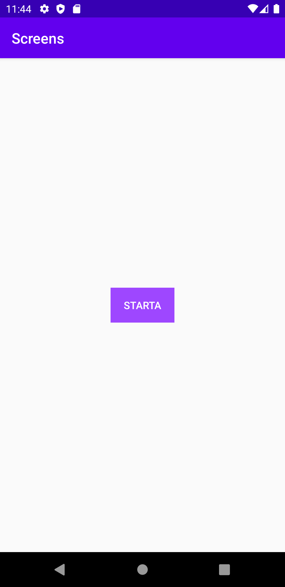

# Rapport Assignment 4

## Skapat en aktivitet
För att skapa en ny screen i applikationen behövde en ny aktivitet skapas genom att välja "blank activity" i mappen "app". Den nya aktiviteten döps till screen2. Då en ny aktivitet har skapats bildas också ett antal nya filer. I de nya filerna adderas en mängd kod per automatik samtidigt som kod adderas till AndroidManifest.xml. De nya filerna som skapas är dels en JAVA-fil samt en XML-fil.

## Skapat en LinearLayout
I filen activity_main.xml som hanterar layouten för applikationens startsida finns ett befintligt textView element. TextView elementet tas bort och ersätts istället med en LinearLayout. Det nya elementet LinearLayout får en bredd och höjd som är satt till wrap_content vilket betyder att det kommer att ta upp så mycket plats som krävs för innehållet. Dessutom finns det fyra rader kod som styr layout_constraint följt av en riktning. De fyra raderna är satt till parent vilket betyder att LinearLayout elementet kommer att placeras centrerat på applikationens skärm. Elementet har också en orientering som är satt till vertical vilket betyder att elementen som LinearLayout innehåller kommer att placeras uppifrån och ner, dvs. vertikalt.

```
 <LinearLayout
        android:layout_width="wrap_content"
        android:layout_height="wrap_content"
        android:orientation="vertical"
        app:layout_constraintBottom_toBottomOf="parent"
        app:layout_constraintLeft_toLeftOf="parent"
        app:layout_constraintRight_toRightOf="parent"
        app:layout_constraintTop_toTopOf="parent" >
```

## Skapat en Button
I elementet LinearLayout skapas också en Button istället för det TextView element som fanns från början. Button elementet får en bredd som är satt till match_parent vilket betyder att bredden kommer vara lika bred som föräldern. Höjden däremot är satt till wrap_content vilket betyder att höjden kommer att anpassas efter innehållet i elementet. Höjden kommer alltså att anpassas efter den text som placeras på knappen. I detta fall appliceras en text som är satt till "Starta". Knappen får också en bakgrundsfärg applicerad för att tydliggöra elementet mot applikationens bakgrund. Sist anges också ett ID på elementet som kommer att användas för att kunna styra knappens funktionalitet.

```
<Button
            android:id="@+id/start_button"
            android:layout_width="match_parent"
            android:layout_height="wrap_content"
            android:text="Starta"
            android:background="#9e47ff"
            android:textColor="#fff"/>
```

## Import och hämtning av Button
I MainActivity.java måste elementet Button importeras och hämtas. För att hämta elementet Button anges elementet följt av ett angivet namn. Därefter används ett lika med tecken tillsammans med findViewById som följs av en parentes. Parentesen innehåller det ID som angavs på Button elementet i layoutfilen. När elementet är hämtat importeras Button automatiskt i MainActivity.java.

```
Button button = findViewById(R.id.start_button);
```
```
import android.widget.Button;
```

## Intent-filter
I AndroidManifest.xml finns nu två stycken aktiviteter som kommer att presenteras i applikationen. Den aktivitet som heter MainActivity är den aktivitet som kommer att starta när applikationen öppnas. Därför anges ett intent-filter inuti activity android:name=".MainActivity" för att applikationen ska veta vilken aktivitet som ska öppnas först. Den andra aktiviteten får intenten angiven i funktionen setOnClickListener för button elementet i MainActivity.java.

```
<activity android:name=".MainActivity">
            <intent-filter>
                <action android:name="android.intent.action.MAIN" />

                <category android:name="android.intent.category.LAUNCHER" />
            </intent-filter>
        </activity>
        <activity android:name=".screen2">
        </activity>
```

## SetOnClickListener
I MainActivity.java måste en SetOnClickListener appliceras för att applikationen ska lyssna på en knapptryckning från användaren. Därför anges namnet på elementet tillsammans med SetOnClickListener följt av (new View.OnClickListener). Den rad kod som applicerats skapar automatiskt en onClick funktion. Inuti funktionen ska den kod som styr vad som händer vid en knapptryckning appliceras. I applikationen ska nästa aktivitet presenteras när användaren trycker på knappen. Därför skapas en Intent i funktionen onClick. För att skapa en Intent anges Intent följt av ett angivet namn. Därefter appliceras ett lika med tecken följt av new Intent(MainActivity.this, screen2.class). MainActivity anges framför this eftersom det är den aktivitet som innehåller knappen och framför class anges screen2 som är den aktivitet som ska presenteras efter knapptryckningen. Efter att en Intent har skapats anges startActivity(intent) vilket kommer att starta aktiviteten. I koden finns också en Log.d som kontrollerar att rätt saker sker vid rätt tillfälle i applikationen. I och med att kod appliceras i funktionen onCreate importeras också ett antal olika element i MainActivity.java.

```
button.setOnClickListener(new View.OnClickListener() {
            @Override
            public void onClick(View v) {
                Intent intent = new Intent(MainActivity.this, screen2.class);
                startActivity(intent);
                Log.d("knapp", "trycker på knappen");
            }
        });
```

## Fragment
På den andra aktiviteten dvs. screen2 ska ett fragment presenteras. För att skapa ett fragment skapas ett nytt blankt fragment. Det nya tomma fragmentet döps till NyFragment. I och med skapandet bildas också två stycken nya filer, fragment_ny.xml och NyFragment.java. För att fragmentet ska presenteras på den andra aktiviteten screen2 måste elementet appliceras i activity_screen2.xml. Men innan fragmentet läggs till skapas en ny LinearLayout på aktivitet 2 för att få en bra layoutstruktur. Elementet LinearLayout har en bredd och höjd som är satt till wrap_content samt en orientering som är vertical. För att placera elementet centrerat på skärmen används parent på de fyra rader kod som anger layout_constraint följt av en riktning. Inuti elementet LinearLayout appliceras fragment. Elementet fragment får en fast bredd och höjd som är satt till 240dp på båda raderna. Fragmentet kommer därmed att ha en fyrkantig form oavsett innehåll. Förutom att ange storleken anges också name och tag på elementet. När fragment är tillagt i activit_screen2.xml kommer elementet att presenteras på sidan som presenteras när användaren trycker på knappen.

```
<LinearLayout
        android:layout_width="wrap_content"
        android:layout_height="wrap_content"
        android:orientation="vertical"
        app:layout_constraintBottom_toBottomOf="parent"
        app:layout_constraintLeft_toLeftOf="parent"
        app:layout_constraintRight_toRightOf="parent"
        app:layout_constraintTop_toTopOf="parent" >

        <fragment
            android:name="com.example.screens.NyFragment"
            android:layout_width="match_parent"
            android:layout_height="240dp"
            android:tag="fragment_ny" />
    </LinearLayout>
```

## Widgets

#### TextView
Inuti fragmentet finns två stycken widgets. Den första är ett TextView element som innehåller en sträng. Strängen skriver ut "Skriv ditt namn i rutan nedan:" och har en vit textfärg. Storleken på elementet är satt till match_parent på både bredden och höjden vilket betyder att storleken kommer vara densamma som fragmentet. För att texten inte ska vara placerad för nära kanten av elementet anges en margin på 20dp. Sist ökas också textstorleken på elementet genom att ange textSize tillsammans med 18sp.

```
<TextView
        android:layout_width="match_parent"
        android:layout_height="match_parent"
        android:text="Skriv ditt namn i rutan nedan:"
        android:layout_margin="20dp"
        android:textColor="#fff"
        android:textSize="18sp"/>
```

#### EditText
Den andra widget som appliceras inuti fragmentet är ett EditText element. Elementet tillåter användaren att göra egna inmatningar i applikationen. För att användaren ska veta att det är ett namn som ska appliceras i rutan anges namn som texthint på elementet. Elementets bredd är satt till match_parent och kommer därmed vara lika bred som fragmentet. Höjden däremot är satt till wrap_content vilket betyder att höjden kommer att anpassas efter innehållet i elementet. För att elementet ska ha samma marginaler som TextView elementet anges 20 dp på både marginleft och marginright i koden. I koden finns också margintop tillsammans med 50dp vilket betyder att elementet kommer att flyttas ned en bit från toppen för att få ett lagom avstånd till TextView elementet och för att inte hamna i skymundan. Den sista stylingen som applicerats på elementet är byte av färg på specifika delar. Färgen på text, textHint och backgroundTint är ändrad till en vit färg istället för den mörka färgen som var från början. Den nya stylingen synliggör elementet samtidigt som designen är väl anpassad till den styling som är applicerad på TextView elementet.

```
<EditText
           android:layout_width="match_parent"
           android:layout_height="wrap_content"
           android:hint="Namn"
           android:id="@+id/my_edittext"
           android:layout_marginLeft="20dp"
           android:layout_marginRight="20dp"
           android:layout_marginTop="50dp"
           android:textColor="#fff"
           android:textColorHint="#fff"
           android:backgroundTint="#fff" />
```


## Screenshot på aktivitet 1


## Screenshot på aktivitet 2


